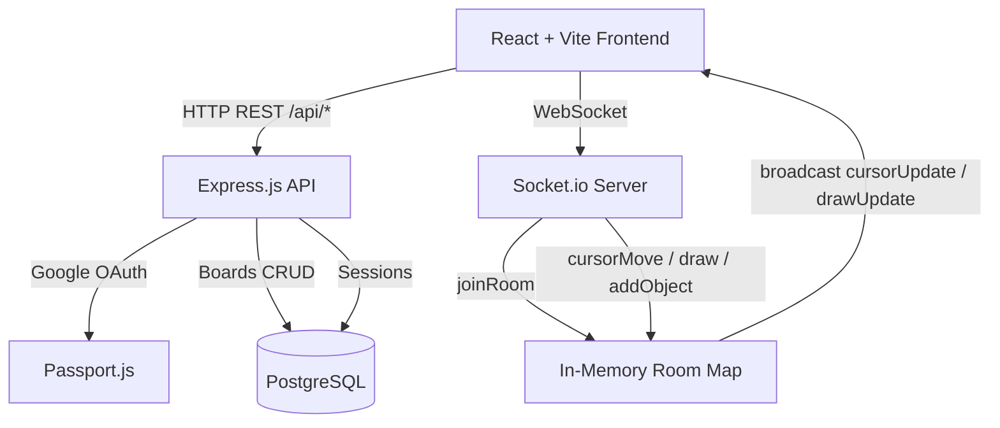

# CollabBoard — Real-Time Collaborative Whiteboard

A production-ready, full-stack real-time collaborative whiteboard application.

> [!IMPORTANT]
> **Google OAuth Required**
> Copy `.env.example` to `.env` and fill in your Google OAuth credentials before running.
> Get them free at [console.cloud.google.com](https://console.cloud.google.com) → APIs & Services → Credentials → OAuth 2.0 Client IDs

---

## ✨ Features

| Feature | Details |
|---|---|
| **Real-Time Drawing** | Freehand pen + rectangle shapes, synced live via WebSockets |
| **Multiplayer Cursors** | See every connected user's cursor with their name in real-time |
| **Live User List** | Active collaborators shown with `data-testid="user-list"` |
| **Undo / Redo** | Per-user action history stacks (`data-testid="undo-button"`, `"redo-button"`) |
| **Google OAuth** | Secure login via Passport.js + persistent PostgreSQL sessions |
| **Guest Mode** | One-click guest access — no account needed |
| **Board Persistence** | Save and load boards to PostgreSQL as JSONB |
| **WebSocket Rooms** | Board-scoped Socket.io rooms for isolated collaboration |
| **Dockerized** | Full stack orchestrated with a single `docker-compose up` command |

---

## 🏗 Architecture



### Tech Stack

| Layer | Technology |
|---|---|
| **Frontend** | React 18, TypeScript, Vite, react-konva, Zustand, Framer Motion, Socket.io-client |
| **Backend** | Node.js, Express, TypeScript, Socket.io, Passport.js, express-session |
| **Database** | PostgreSQL with connect-pg-simple session store |
| **Auth** | Google OAuth 2.0 via passport-google-oauth20 |
| **Infrastructure** | Docker, Docker Compose, Nginx (frontend) |

---

## ⚙️ Local Setup

### Prerequisites
- [Docker Desktop](https://www.docker.com/products/docker-desktop/)
- Google Cloud OAuth 2.0 credentials

### Step 1 — Clone and configure

```bash
git clone https://github.com/shahanth4444/collaborative-whiteboard.git
cd collaborative-whiteboard
cp .env.example .env
```

Edit `.env` and fill in your Google OAuth credentials:

```env
GOOGLE_CLIENT_ID=your-client-id-here
GOOGLE_CLIENT_SECRET=your-client-secret-here
SESSION_SECRET=any-random-secret-string
```

In Google Cloud Console, add this Authorized Redirect URI:
```
http://localhost:3001/api/auth/google/callback
```

### Step 2 — Start all services

```bash
docker-compose up --build
```

This starts:
- **Frontend** on `http://localhost:3000`
- **Backend API** on `http://localhost:3001`
- **PostgreSQL** on port `5432` (internal)

The database tables are created automatically from `backend/seeds/01_init.sql`.

### Step 3 — Open the app

| URL | Description |
|---|---|
| `http://localhost:3000` | The whiteboard app |
| `http://localhost:3001/health` | Backend health check |
| `http://localhost:3001/api/auth/session` | Current user session |

---

## 🔌 API Reference

### REST Endpoints

| Method | Path | Description |
|---|---|---|
| `GET` | `/health` | Health check → `{ status, timestamp }` |
| `GET` | `/api/auth/session` | Get current user → `{ user }` or 401 |
| `GET` | `/api/auth/google` | Start Google OAuth flow |
| `GET` | `/api/auth/google/callback` | OAuth callback handler |
| `POST` | `/api/auth/guest` | Create guest session → `{ user }` |
| `GET` | `/api/auth/logout` | Destroy session |
| `POST` | `/api/boards` | Create new board → `{ boardId }` |
| `POST` | `/api/boards/:boardId` | Save board state `{ objects }` |
| `GET` | `/api/boards/:boardId` | Load board state → `{ boardId, objects, updatedAt }` |

### WebSocket Events

#### Client → Server
| Event | Payload | Description |
|---|---|---|
| `joinRoom` | `{ boardId }` | Join a board room |
| `cursorMove` | `{ x, y }` | Broadcast cursor position |
| `draw` | `{ points, color, brushSize, tool }` | Broadcast freehand stroke |
| `addObject` | `{ id, type, x, y, width, height, fill, stroke }` | Broadcast new shape |

#### Server → Client
| Event | Payload | Description |
|---|---|---|
| `roomUsers` | `[{ userId, name }]` | Updated list of room users |
| `cursorUpdate` | `{ userId, x, y, name }` | Remote cursor moved |
| `drawUpdate` | `{ userId, points, color, brushSize, tool }` | Remote freehand stroke |
| `objectAdded` | `{ userId, id, type, x, y, ... }` | Remote shape added |

---

## 🧪 Testing

### Automated Evaluation
A `submission.json` is included at the root. The frontend implements all required `data-testid` attributes:
- `data-testid="user-list"` — Active users panel
- `data-testid="remote-cursor"` — Per-user cursor elements
- `data-testid="tool-pen"` — Pen tool button
- `data-testid="tool-rectangle"` — Rectangle tool button
- `data-testid="undo-button"` — Undo action
- `data-testid="redo-button"` — Redo action

`window.getCanvasAsJSON()` is exposed globally for Playwright canvas inspection.

### Manual Multi-User Test
1. Open `http://localhost:3000` in **Chrome** → Login as Guest
2. Create a new board — copy the board URL
3. Open the same URL in **Incognito** → Login as another Guest
4. Draw on either screen → see live cursor and drawing sync!

---

## 📁 Project Structure

```
collaborative-whiteboard/
├── docker-compose.yml          # Orchestrates all 3 services
├── .env.example                # Environment variable template
├── submission.json             # Evaluator credentials payload
├── backend/
│   ├── Dockerfile
│   ├── src/
│   │   ├── index.ts            # Express + Socket.io server
│   │   ├── auth/passport.ts    # Google OAuth configuration
│   │   ├── db/index.ts         # PostgreSQL connection pool
│   │   ├── routes/
│   │   │   ├── health.ts       # GET /health
│   │   │   ├── auth.ts         # OAuth + session routes
│   │   │   └── boards.ts       # Board CRUD routes
│   │   └── socket/index.ts     # WebSocket event handlers
│   └── seeds/01_init.sql       # DB schema creation
└── frontend/
    ├── Dockerfile
    ├── src/
    │   ├── App.tsx             # Router + auth guards
    │   ├── pages/
    │   │   ├── LoginPage.tsx   # Animated entry screen
    │   │   ├── DashboardPage.tsx
    │   │   └── BoardPage.tsx
    │   ├── components/
    │   │   ├── Canvas.tsx      # Konva drawing canvas
    │   │   ├── Toolbar.tsx     # Tool switcher
    │   │   ├── UserList.tsx    # Live collaborators
    │   │   └── RemoteCursors.tsx
    │   └── store/
    │       ├── authStore.ts    # Zustand auth state
    │       └── canvasStore.ts  # Zustand canvas + undo/redo
    └── vite.config.ts          # Vite + proxy config
```
